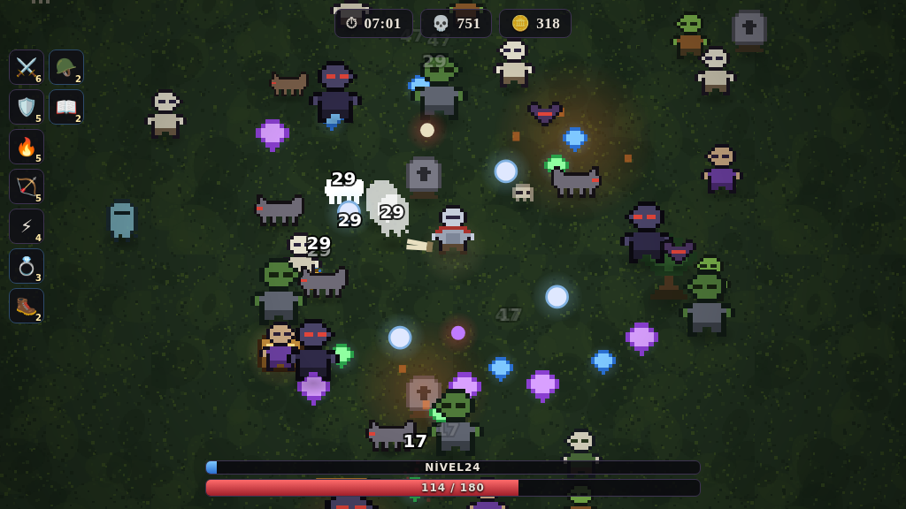

# ⚔️ Reino Sombrio

Um jogo de sobrevivência contra hordas no estilo **Vampire Survivors / Brotato**, só que
em versão **medieval**. Feito em HTML, CSS e JavaScript puro — sem nenhuma biblioteca,
sem instalar nada.



## ▶️ Como jogar

**Jeito mais fácil:** abra o arquivo `index.html` com dois cliques. Ele roda direto no
navegador (Chrome, Edge, Firefox), inclusive sem internet.

Se quiser jogar pelo celular ou mandar o link para alguém, dá para publicar de graça
com o GitHub Pages: em **Settings → Pages**, escolha a branch e salve. O jogo fica em
`https://nevviz54.github.io/Nevviz54/jogo-medieval/`.

## 🎮 Controles

| Ação | Teclado | Celular |
|------|---------|---------|
| Mover | `W A S D` ou setas | arraste o dedo na tela |
| Atacar | automático | automático |
| Pausar | `ESC` ou `P` | botão de pausa do menu |

Você só se preocupa em **desviar** — as armas atiram sozinhas no inimigo mais próximo.

## 🩸 Como funciona

- **Gemas azuis** dão experiência. Ao subir de nível você escolhe 1 de 3 cartas.
- **Moedas** ficam guardadas mesmo quando você morre e são gastas na **Ferraria**
  (melhorias permanentes que valem para todas as próximas partidas).
- **Baús** caem de inimigos de elite (os que brilham em laranja) e dos chefes.
- **Chefes** aparecem aos 5, 10 e 15 minutos. Derrotar o **Rei Vampiro** é a vitória.
- **Evoluções:** arma no nível MÁX + o item passivo certo no nível 5 = arma lendária.

| Arma no máximo | + Passivo nível 5 | = Evolução |
|---|---|---|
| Espada Longa | Anel de Poder | **Excalibur** |
| Besta | Ampulheta | **Balista Sagrada** |
| Aura Sagrada | Coração de Leão | **Círculo Divino** |
| Fogo Grego | Tomo Antigo | **Inferno Sagrado** |

## 🧙 Heróis

| Herói | Arma inicial | Estilo |
|-------|--------------|--------|
| 🛡️ Cavaleiro | Espada Longa | resistente, bom para começar |
| 🏹 Arqueiro | Besta | rápido e de longe |
| 🔮 Bruxa | Fogo Grego | frágil, mas com muita área |
| ✨ Paladino | Aura Sagrada | desbloqueia com 600 de ouro |

## 📁 Organização do código

```
jogo-medieval/
├── index.html      → estrutura das telas (menu, loja, HUD)
├── style.css       → visual da interface
└── js/
    ├── utils.js    → funções de matemática, grade de colisão e salvamento
    ├── audio.js    → música e efeitos gerados na hora (Web Audio API)
    ├── art.js      → a pixel art, desenhada por código a partir de mapas de texto
    ├── data.js     → CONTEÚDO: heróis, armas, monstros, chefes e loja
    └── game.js     → o motor: laço principal, colisões, desenho e telas
```

## 🔧 Quer mexer no jogo?

Quase tudo o que dá vontade de mudar está em **`js/data.js`**:

- Deixar uma arma mais forte → mexa no `dano` dentro de `stats(n)`.
- Criar um monstro novo → copie um bloco em `MONSTROS` e mude nome, vida e velocidade.
  O campo `desde` é o segundo em que ele começa a aparecer.
- Mudar os chefes → lista `CHEFES` (o campo `tempo` é quando ele aparece).
- Preço das melhorias → lista `LOJA`.

E em **`js/art.js`** os desenhos são mapas de texto: cada letra é uma cor da paleta e
`.` é transparente. Dá para desenhar um monstro novo só escrevendo linhas de texto.

Para mudar quanto tempo dura a partida, procure `DURACAO` no começo do `js/game.js`.

---

Feito para o **D.F.B.G PRODUCTIONS** 🎮
